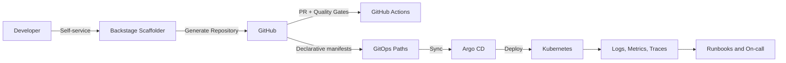

[Português (Brasil)](README.pt-BR.md) | **English**

# GoldenPath IDP

A production-oriented Internal Developer Platform (IDP) repository designed to reduce service bootstrap time, enforce engineering standards, and improve operational reliability.

## Executive Summary

This repository provides a practical platform engineering baseline:

- Self-service service provisioning through Backstage Scaffolder templates
- Reference Golden Paths for HTTP APIs and asynchronous workers
- GitOps deployment model with Argo CD app-of-apps
- Prescriptive standards for observability, security, CI/CD, and ownership
- Operational runbooks and architecture decisions for real-world incidents

## Professional Profile

- Name: `NAME_PLACEHOLDER`
- Role: `TITLE_PLACEHOLDER`
- Location/Timezone: `LOCATION_TIMEZONE_PLACEHOLDER`
- LinkedIn: `LINKEDIN_PLACEHOLDER`
- Email: `EMAIL_PLACEHOLDER`

## Why this repository proves seniority

- Architecture decisions with explicit trade-offs:
  - `docs/en/adr/0001-idp-scope-and-non-goals.md`
  - `docs/en/adr/0003-gitops-argocd-app-of-apps.md`
- Operational readiness with production-style runbooks:
  - `docs/en/runbooks/deploy-failure.md`
  - `docs/en/runbooks/rollback.md`
- Security and risk ownership:
  - `docs/en/threat-model.md`
  - `.github/workflows/security.yml`
- Platform governance and quality gates:
  - `docs/en/standards/ci-cd.md`
  - `docs/en/standards/security-baseline.md`
  - `.github/workflows/ci.yml`

## Platform Impact Targets

- Lead time reduction for new services: from days to hours
- Golden Path compliance for new services: >90%
- MTTR improvement through standardized runbooks and telemetry
- Deployment governance by PR + GitOps + mandatory checks

## Repository Scope

- `templates/microservice-http`: Node.js/TypeScript HTTP service blueprint
- `templates/worker-event`: Node.js/TypeScript async worker blueprint
- `backstage/overlays`: overlays to register templates and catalog entities
- `gitops/argocd`: root app, child apps, and deployment manifests
- `docs/en`: full English documentation
- `docs/pt-br`: full Portuguese (Brazil) documentation

## Architecture



## How To Use

### 1. Bootstrap Backstage in a real machine

This workspace is intentionally constrained; heavy bootstrap is not executed here.

```bash
npx @backstage/create-app@latest
```

Then apply this repository overlays from `backstage/overlays` as documented in `backstage/README.md`.

### 2. Register templates in Backstage catalog

Add catalog location pointing to:

- `backstage/overlays/catalog/locations.yaml`

Confirm templates are visible in Scaffolder:

- `microservice-http`
- `worker-event`

### 3. Generate a service using Golden Paths

Provide template parameters:

- service name (`kebab-case`)
- owner entity
- target GitHub repository

### 4. Enable GitOps with Argo CD

Apply manifests in order (outside this constrained environment):

```bash
kubectl create namespace argocd
kubectl apply -n argocd -f https://raw.githubusercontent.com/argoproj/argo-cd/stable/manifests/install.yaml
kubectl apply -f gitops/argocd/manifests/namespaces.yaml
kubectl apply -f gitops/argocd/manifests/projects.yaml
kubectl apply -f gitops/argocd/manifests/repositories.yaml
kubectl apply -f gitops/argocd/app-of-apps/root-app.yaml
```

### 5. Run lightweight repository checks

```bash
make check
```

## Documentation

- English index: `docs/en/index.md`
- Portuguese index: `docs/pt-br/index.md`

## Roadmap

- `v0.2.x`: bilingual documentation hardening + recruiter-facing narrative
- `v0.3.x`: additional Golden Paths and scorecards
- `v0.4.x`: SLO/SLI operating model and dashboards
- `v0.5.x`: platform adoption metrics by domain/team
