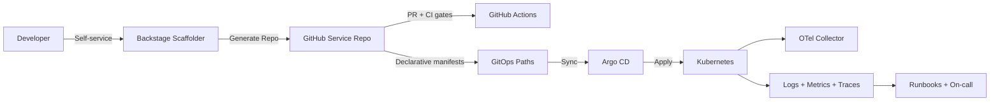

# Golden Path IDP

Plataforma interna de engenharia para acelerar criação de serviços com padrão de produção desde o primeiro commit.

## Visão geral

`goldenpath-idp` consolida um stack de referência para times de produto e plataforma:

- Provisionamento self-service via Backstage Scaffolder
- Templates prontos para serviço HTTP e worker assíncrono
- Governança técnica com padrões prescritivos
- Entrega declarativa com Argo CD (app-of-apps)
- Operação orientada a observabilidade, segurança e ownership

## Objetivo de mercado

Organizações em crescimento sofrem com variabilidade de setup, observabilidade inconsistente e CI/CD frágil. O objetivo do IDP é transformar isso em capacidade operacional repetível.

Resultados esperados (alvo de adoção):

- Reduzir tempo de bootstrap de novos serviços de dias para horas
- Aumentar conformidade mínima de engenharia para >90% dos serviços novos
- Diminuir MTTR com contratos uniformes de logs, health checks e runbooks

## Problema que este repositório resolve

Sem plataforma:

- Cada squad cria bootstrap próprio e repete decisões básicas
- Segurança e observabilidade entram tarde no ciclo
- Deploy e rollback têm fluxos diferentes por time

Com este repositório:

- O serviço nasce com contrato padrão e CI mínimo
- O catálogo Backstage já conhece owners, templates e sistema
- Deploy segue GitOps com trilha de auditoria por PR

## Entregáveis principais

- `templates/microservice-http`: API Node.js/TS com `/health`, `/ready`, logs JSON, `request_id`, pontos de OTel
- `templates/worker-event`: worker Node.js/TS com retry/backoff, métricas e stub de DLQ
- `backstage/overlays`: integração de catálogo e templates sem gerar Backstage aqui
- `gitops/argocd`: root app + apps filhas + manifests de referência
- `docs/standards`, `docs/runbooks`, `docs/adr`, `docs/threat-model.md`

## Arquitetura



## Como usar

### 1) Preparar Backstage (máquina real)

Este ambiente está em modo restrito; bootstrap pesado não é executado aqui.

```bash
npx @backstage/create-app@latest
```

Aplique overlays de `backstage/overlays` conforme `backstage/README.md`.

### 2) Registrar catálogo e templates

- Referencie `backstage/overlays/catalog/locations.yaml` no `app-config.yaml`
- Confirme no Scaffolder os templates:
  - `microservice-http`
  - `worker-event`

### 3) Gerar um serviço

No Backstage, selecione template e informe:

- nome técnico (`kebab-case`)
- owner (entidade de catálogo)
- repositório GitHub de destino

### 4) Ativar GitOps com Argo CD

Fluxo recomendado em ambiente real:

```bash
kubectl create namespace argocd
kubectl apply -n argocd -f https://raw.githubusercontent.com/argoproj/argo-cd/stable/manifests/install.yaml
kubectl apply -f gitops/argocd/manifests/namespaces.yaml
kubectl apply -f gitops/argocd/manifests/projects.yaml
kubectl apply -f gitops/argocd/manifests/repositories.yaml
kubectl apply -f gitops/argocd/app-of-apps/root-app.yaml
```

Como adicionar um novo app via PR:

1. Criar `gitops/argocd/apps/example-novo-app.yaml`
2. Criar manifests em `gitops/argocd/manifests/examples/novo-app/`
3. Abrir PR com risco, impacto e rollback
4. Após merge, Argo CD sincroniza automaticamente

### 5) Rodar validações leves do repositório

```bash
make check
```

O target executa:

- `scripts/check-deps-duplicates.mjs`
- `scripts/check-yaml.sh`

## Roteiro de demo

Resumo executivo da demo (20-30 min):

1. Problema de engenharia e proposta da plataforma
2. Geração de serviço HTTP pelo Scaffolder
3. Evidência de contratos técnicos no código gerado
4. Geração de worker com retry/backoff + DLQ stub
5. Fluxo de CI/security/release
6. App-of-apps no Argo CD
7. Fechamento com runbooks e threat model

Versão detalhada: `docs/demo-script.md`.

## Padrões de engenharia

- Logging: `docs/standards/logging.md`
- OpenTelemetry: `docs/standards/observability-otel.md`
- Health checks: `docs/standards/health-checks.md`
- CI/CD: `docs/standards/ci-cd.md`
- Segurança: `docs/standards/security-baseline.md`
- Ownership e on-call: `docs/standards/ownership-and-oncall.md`
- Contratos dos templates: `docs/standards/golden-path-contracts.md`

## Makefile (dry-run friendly)

Todos os targets da raiz são seguros para ambiente restrito e não executam bootstrap automático de dependências:

- `make bootstrap`
- `make dev`
- `make validate`
- `make docs`
- `make gitops`
- `make templates`
- `make check`

## Roadmap

- v0.2.0: policy-as-code para gates de segurança e conformidade
- v0.3.0: novo Golden Path de BFF/frontend e scorecards de plataforma
- v0.4.0: trilha de SLO/SLI com painéis padrão por serviço
- v0.5.0: métricas de adoção e custo de plataforma por domínio
