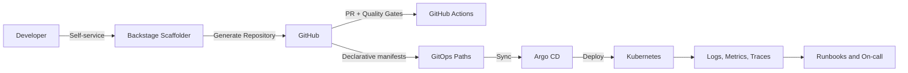

**Português (Brasil)** | [English](README.md)

# GoldenPath IDP

[](https://github.com/saviocodess/goldenpath-idp/actions/workflows/ci.yml)
[](https://github.com/saviocodess/goldenpath-idp/actions/workflows/security.yml)
[](https://github.com/saviocodess/goldenpath-idp/actions/workflows/release.yml)
[](LICENSE)

Repositório de Internal Developer Platform (IDP) orientado a produção para reduzir tempo de bootstrap de serviços, padronizar engenharia e aumentar confiabilidade operacional.

## Resumo Executivo

Este repositório entrega uma base prática de engenharia de plataforma:

- Provisionamento self-service por templates do Backstage Scaffolder
- Golden Paths de referência para APIs HTTP e workers assíncronos
- Modelo de deploy GitOps com Argo CD app-of-apps
- Padrões prescritivos de observabilidade, segurança, CI/CD e ownership
- Runbooks operacionais e decisões arquiteturais para cenários reais

## Perfil Profissional

- Nome: `NAME_PLACEHOLDER`
- Cargo: `TITLE_PLACEHOLDER`
- Localização/Fuso: `LOCATION_TIMEZONE_PLACEHOLDER`
- LinkedIn: `LINKEDIN_PLACEHOLDER`
- Email: `EMAIL_PLACEHOLDER`

## Por que este repositório prova senioridade

- Decisões de arquitetura com trade-offs explícitos:
  - `docs/pt-br/adr/0001-idp-scope-and-non-goals.md`
  - `docs/pt-br/adr/0003-gitops-argocd-app-of-apps.md`
- Prontidão operacional com runbooks de padrão produção:
  - `docs/pt-br/runbooks/deploy-failure.md`
  - `docs/pt-br/runbooks/rollback.md`
- Segurança e ownership de risco:
  - `docs/pt-br/threat-model.md`
  - `.github/workflows/security.yml`
- Governança de plataforma e gates de qualidade:
  - `docs/pt-br/standards/ci-cd.md`
  - `docs/pt-br/standards/security-baseline.md`
  - `.github/workflows/ci.yml`

## Metas de Impacto da Plataforma

- Redução de lead time de novos serviços: de dias para horas
- Conformidade de Golden Path em novos serviços: >90%
- Melhoria de MTTR via runbooks e telemetria padronizados
- Governança de deploy por PR + GitOps + checks obrigatórios

## Escopo do Repositório

- `templates/microservice-http`: blueprint Node.js/TypeScript para serviço HTTP
- `templates/worker-event`: blueprint Node.js/TypeScript para worker assíncrono
- `backstage/overlays`: overlays para registrar templates e entidades de catálogo
- `gitops/argocd`: root app, apps filhas e manifests de deploy
- `docs/en`: documentação completa em inglês
- `docs/pt-br`: documentação completa em português (Brasil)

## Arquitetura



## Como Usar

Quick start após clonar:

```bash
bash scripts/preflight-tools.sh
make check
```

Para setup de ponta a ponta (Backstage + serviço gerado + Argo CD), siga:

- `docs/pt-br/getting-started.md`

### 1. Fazer bootstrap do Backstage em máquina real

Este workspace é intencionalmente restrito; bootstrap pesado não é executado aqui.

```bash
npx @backstage/create-app@latest
```

Depois aplique os overlays deste repositório em `backstage/overlays`, conforme `backstage/README.md`.

### 2. Registrar templates no catálogo do Backstage

Adicione uma catalog location apontando para:

- `backstage/overlays/catalog/locations.yaml`

Confirme que os templates aparecem no Scaffolder:

- `microservice-http`
- `worker-event`

### 3. Gerar serviço pelos Golden Paths

Informe os parâmetros do template:

- nome do serviço (`kebab-case`)
- entidade owner
- repositório GitHub de destino

### 4. Habilitar GitOps com Argo CD

Aplique os manifests em ordem (fora deste ambiente restrito):

```bash
kubectl create namespace argocd
kubectl apply -n argocd -f https://raw.githubusercontent.com/argoproj/argo-cd/stable/manifests/install.yaml
kubectl apply -f gitops/argocd/manifests/namespaces.yaml
kubectl apply -f gitops/argocd/manifests/projects.yaml
kubectl apply -f gitops/argocd/manifests/repositories.yaml
kubectl apply -f gitops/argocd/app-of-apps/root-app.yaml
```

### 5. Executar validações leves do repositório

```bash
make check
```

## Documentação

- Índice em inglês: `docs/en/index.md`
- Índice em português: `docs/pt-br/index.md`
- Onboarding ponta a ponta: `docs/pt-br/getting-started.md`

## Operação do Repositório no GitHub

Para manter os checks verdes e a automação de segurança totalmente funcional:

- Habilite o Dependency Graph nas configurações do repositório no GitHub:
  - `Settings -> Security -> Advanced Security / Dependency graph`
- Após o dependency graph estar ativo, defina a variável de repositório `ENABLE_DEPENDENCY_REVIEW=true`
  para habilitar o job de dependency review em `.github/workflows/security.yml` nas pull requests.
- A variável opcional `ENABLE_FULL_CI=true` habilita install/lint/test/build em `.github/workflows/ci.yml`.
- O modo padrão de CI continua leve (checks equivalentes a `make check`) para preservar portabilidade em ambientes restritos.

## Roadmap

- `v0.2.x`: fortalecimento da documentação bilíngue + narrativa para recrutadores
- `v0.3.x`: novos Golden Paths e scorecards
- `v0.4.x`: modelo operacional de SLO/SLI e dashboards
- `v0.5.x`: métricas de adoção de plataforma por domínio/time
